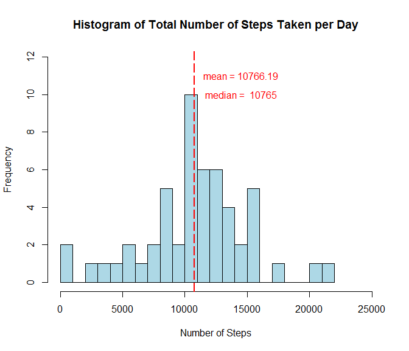
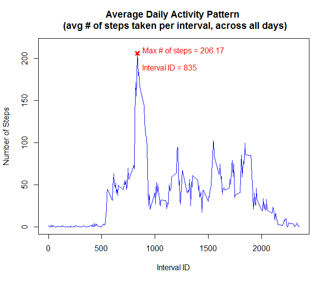
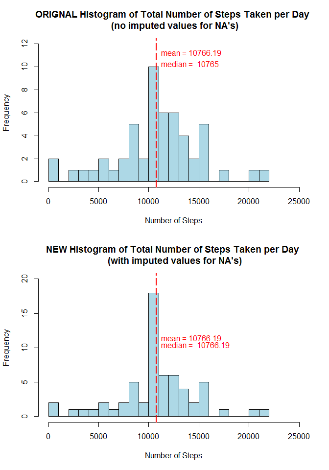
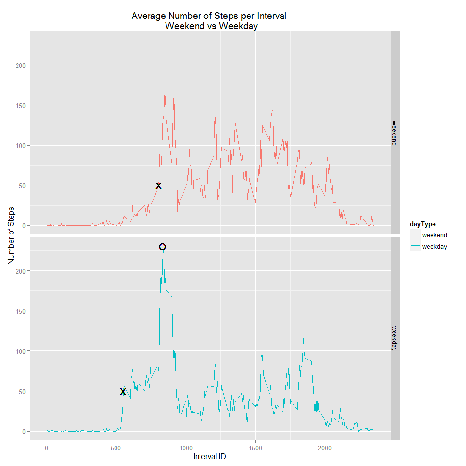

# Reproducible Research: Peer Assessment 1


## Loading and preprocessing the data
This assignment uses data from a personal activity monitoring device which records the number of steps taken in 5 minute intervals each day for a single anonymous individual over a two month period in October and November of 2012.  The dataset is available on https://github.com/jngbutler/RepData_PeerAssessment1/blob/master/activity.zip    

The dataset has 17,568 rows.  There are 288 intervals (5-minute observations) per day for 61 days.  The variables in this dataset are:
* **steps**: the number of steps in a 5-minute interval
* **date**: the date the measurement was taken
* **interval**: the identifier of the 5-minute interval when the measurement was taken

First, read in the data using **read.csv()**.  Set the date column to "character" using **colClasses()** before converting it into class "date"" using the **as.Date()** function.


```r
data <- read.csv("activity.csv",colClasses=c(steps="integer",
                                             date="character",
                                             interval="integer"))
data$date <- as.Date(data$date,"%Y-%m-%d") 
```

## What is mean total number of steps taken per day?
Calculate the mean and median number of steps taken per day by first computing the sum of the total number of steps for each day using the **aggregate()** function.


```r
StepsPerDay <- aggregate(data$steps ~ data$date, data, FUN="sum")
head(StepsPerDay)
```

```
##    data$date data$steps
## 1 2012-10-02        126
## 2 2012-10-03      11352
## 3 2012-10-04      12116
## 4 2012-10-05      13294
## 5 2012-10-06      15420
## 6 2012-10-07      11015
```

And then compute the mean and median using **mean()** and **median()**. 


```r
meanSteps = mean(StepsPerDay[,2])
medianSteps = median(StepsPerDay[,2])
```

The **mean** number of steps taken per day is 10,766.19 and the **median** is 10,765.


```r
meanSteps
```

```
## [1] 10766.19
```

```r
medianSteps
```

```
## [1] 10765
```

Plot a **histogram (showing the distribution)** of the average number of steps taken each day, showing the mean and median on the plot.  


```r
hist(StepsPerDay[,2],breaks=20, 
     xlab="Number of Steps",
     main = "Histogram of Total Number of Steps Taken per Day",
     xlim = c(0,25000), ylim = c(0,12),
     col="light blue")
abline(v=meanSteps,col="red",lty=5,lwd=2)
text(x=14500,y=11,paste(c("mean =", round(meanSteps,digits=2)), collapse=" "),
                        col="red")
text(x=14500,y=10,paste(c("median = ", medianSteps), collapse=" "),
                       col= "red")
```

 

## What is the average daily activity pattern?
First calculate the average number of steps that are taken per interval.  


```r
MeanStepsPerInterval <- aggregate(data$steps ~ data$interval,data=data,FUN="mean")
head(MeanStepsPerInterval)
```

```
##   data$interval data$steps
## 1             0  1.7169811
## 2             5  0.3396226
## 3            10  0.1320755
## 4            15  0.1509434
## 5            20  0.0754717
## 6            25  2.0943396
```

Then use **which.max()** to identify the Maximum Number of Steps and the Interval that contains this maximum.  


```r
MaxSteps <- MeanStepsPerInterval[which.max(MeanStepsPerInterval[,2]),2]
MaxSteps
```

```
## [1] 206.1698
```

```r
MaxInterval <- MeanStepsPerInterval[which.max(MeanStepsPerInterval[,2]),1]
MaxInterval
```

```
## [1] 835
```

Create the **time series plot (type="l")** of the Average number of steps taken per Interval (across all days).  The 5-minute Interval that contains the maximum number of steps is **Interval # 835**.


```r
plot(MeanStepsPerInterval[,1], MeanStepsPerInterval[,2], 
     type="l", 
     xlab= "Interval ID", 
     ylab= "Number of Steps", 
     ylim= c(0,215),
     main= "Average Daily Activity Pattern \n (avg # of steps taken per interval, across all days)",
     col="blue", 
     lwd=1.5)
points(x=MaxInterval, y=MaxSteps, col="red",pch=4,lwd=3)
text(x=MaxInterval+50, y=MaxSteps,
     paste(c("Max # of steps =", round(MaxSteps,digits=2)), collapse=" "),
     adj=c(0,0), col= "red")
text(x=MaxInterval+50, y=MaxSteps-20,
     paste(c("Interval ID =", MaxInterval), collapse=" "),
     adj=c(0,0), col= "red")
```

 

## Imputing missing values
There are a number of missing values (coded as NA) in the dataset.  Missing values can introduce bias into calculations and summaries of the data.  There are **2304 missing values** in the **steps** column. 


```r
sum(is.na(data)); summary(data)
```

```
## [1] 2304
```

```
##      steps             date               interval     
##  Min.   :  0.00   Min.   :2012-10-01   Min.   :   0.0  
##  1st Qu.:  0.00   1st Qu.:2012-10-16   1st Qu.: 588.8  
##  Median :  0.00   Median :2012-10-31   Median :1177.5  
##  Mean   : 37.38   Mean   :2012-10-31   Mean   :1177.5  
##  3rd Qu.: 12.00   3rd Qu.:2012-11-15   3rd Qu.:1766.2  
##  Max.   :806.00   Max.   :2012-11-30   Max.   :2355.0  
##  NA's   :2304
```

The strategy we will utilize to fill in the missing values in the dataset for each interval (5-minute observation period)  is to **use the mean for that particular interval**.  

First we will split the dataset into 2 (one with no NA's, and one with the NA values).  


```r
NA_data <- data[which(is.na(data[,1])),]  
good_data <- data[which(!is.na(data[,1])),]  
```

To impute the missing values for any interval, we will use the **mean value for that interval**.  We can do this by merging the data frame with the NA values to the data frame we created earlier that contains the mean values for each interval.  We use the **merge()** function to merge the data frames by the **"interval"** column that is common to both data frames.


```r
ImputedData <- merge(NA_data, MeanStepsPerInterval,
                     by.x="interval", by.y="data$interval", 
                     all=FALSE)  
head(ImputedData)
```

```
##   interval steps       date data$steps
## 1        0    NA 2012-10-01   1.716981
## 2        0    NA 2012-11-30   1.716981
## 3        0    NA 2012-11-04   1.716981
## 4        0    NA 2012-11-09   1.716981
## 5        0    NA 2012-11-14   1.716981
## 6        0    NA 2012-11-10   1.716981
```

Then we subset to keep only the columns that we need (taking care to preserve the same order of the columns as the original data frames before they were merged), and we re-name them to the original column names.  This provides us with a data frame with all of the missing values "filled in" with the mean values of each interval.


```r
ImputedData <- ImputedData[,c(4,3,1)]
colnames(ImputedData) <- c("steps","date","interval")                 
summary(ImputedData)
```

```
##      steps              date               interval     
##  Min.   :  0.000   Min.   :2012-10-01   Min.   :   0.0  
##  1st Qu.:  2.486   1st Qu.:2012-10-26   1st Qu.: 588.8  
##  Median : 34.113   Median :2012-11-06   Median :1177.5  
##  Mean   : 37.383   Mean   :2012-11-01   Mean   :1177.5  
##  3rd Qu.: 52.835   3rd Qu.:2012-11-11   3rd Qu.:1766.2  
##  Max.   :206.170   Max.   :2012-11-30   Max.   :2355.0
```

Finally, use the **rbind()** function to combine the data frame with the completed cases to the data frame with the imputed values to get a new dataset that has no missing values.


```r
newData <- rbind(good_data,ImputedData)
str(newData)
```

```
## 'data.frame':	17568 obs. of  3 variables:
##  $ steps   : num  0 0 0 0 0 0 0 0 0 0 ...
##  $ date    : Date, format: "2012-10-02" "2012-10-02" ...
##  $ interval: int  0 5 10 15 20 25 30 35 40 45 ...
```

Now we will plot the histogram of the total number of steps taken each day for this new dataset.  Do this in the same manner as before, by summing the number of steps over each interval.


```r
StepsPerDay2 <- aggregate(newData$steps ~ newData$date, newData, FUN="sum")
```

And then computing the mean and median.  The **mean** and **median** number of steps (to 2 decimal places) for the new dataset with imputed values are both 10,766.19.


```r
meanSteps2 = mean(StepsPerDay2[,2])
mean(StepsPerDay2[,2])
```

```
## [1] 10766.19
```

```r
medianSteps2 = median(StepsPerDay2[,2])
median(StepsPerDay2[,2])
```

```
## [1] 10766.19
```

Plot the **histograms** for both the original dataset as well as the new dataset with the imputed values so we can examine them.


```r
par(mfrow=c(2,1))  ## places plots on top of each other

## histogram of original dataset
hist(StepsPerDay[,2],breaks=20,
     xlab="Number of Steps",
     main = "ORIGNAL Histogram of Total Number of Steps Taken per Day \n (no imputed values for NA's)",
     xlim = c(0,25000), ylim = c(0,12), col="light blue")
abline(v=meanSteps,col="red",lty=5,lwd=2)
text(x=meanSteps+500,y=11,paste(c("mean =", round(meanSteps,digits=2)), collapse=" "),
     adj=c(0,0), col= "red")
text(x=medianSteps+500,y=10,paste(c("median = ", medianSteps), collapse=" "),
     adj=c(0,0), col= "red")

## histogram of new dataset
hist(StepsPerDay2[,2],breaks=20,
     xlab="Number of Steps",
     main = "NEW Histogram of Total Number of Steps Taken per Day \n (with imputed values for NA's)",
     xlim = c(0,25000), ylim = c(0,20), col="light blue")
abline(v=meanSteps2,col="red",lty=5,lwd=2)
text(x=meanSteps2+500,y=11,paste(c("mean =", round(meanSteps2,digits=2)), collapse=" "),
     adj=c(0,0), col= "red")
text(x=medianSteps2+500,y=10,paste(c("median = ", round(medianSteps2,digits=2)), collapse=" "),
     adj=c(0,0), col= "red")
```

 

By comparing the histogram of the new dataset with the imputed values with the histogram of the original dataset with the missing values above, we can see that *the values do differ slightly*.  Specifically, the value for the mean number of steps per day did NOT differ from our estimates from the first part of the assignment.  However, the value for the median number of steps per day increased.  In using the strategy of imputing missing values to number of steps taken by using the average for that interval, we:    

1. increased the frequency of values at the mean (because we have imputed it where there are missing values)
2. and this caused the mean and the median to converge

## Are there differences in activity patterns between weekdays and weekends?
Create a new **factor variable** in the dataset (the new dataset with the filled-in missing values) with two levels - "weekday" and "weekend" to indicate whether a given date is during the week from Monday to Friday (weekday) or on Saturday or Sunday (weekend).


```r
newData$dayType <- factor(weekdays(newData$date,abbreviate=FALSE))
levels(newData$dayType) <- list(
  weekend = c("Saturday","Sunday"),
  weekday = c("Monday","Tuesday","Wednesday","Thursday","Friday")
  )
```

Calculate the average number of steps for each interval (across all days, factored by "weekday" and by "weekend").


```r
stepsByIntervalAndDayType <- aggregate(newData$steps, 
                    by=list(newData$interval,newData$dayType),
                    FUN=mean)
colnames(stepsByIntervalAndDayType) <- c("interval","dayType","steps")
```

Make a **time series panel plot** comparing weekdays to weekends, placing the Interval on the x-axis and the averge number of Steps taken on the y-axis.


```r
ggplot(stepsByIntervalAndDayType, aes(y = steps, x = interval)) +
  geom_line(aes(color = dayType)) +
  facet_grid(dayType ~ .) +
  ggtitle("Average Number of Steps per Interval \n Weekend vs Weekday") +
  xlab("Interval ID") +
  ylab("Number of Steps") +
  geom_text(aes(x=550, y=50, label="X", group=NULL), 
            data=subset(stepsByIntervalAndDayType, dayType=="weekday")) +
  geom_text(aes(x=805, y=50, label="X", group=NULL), 
            data=subset(stepsByIntervalAndDayType, dayType=="weekend")) +
  geom_text(aes(x=835, y=230.4, label="O", group=NULL), 
            data=subset(stepsByIntervalAndDayType, dayType=="weekday")) 
```

 

In the above panel plot, select data points are annotated manually.  Comparing the average number of steps per interval during a weekend day and during a weekday, we can see that generally speaking there are *more* steps taken during a weekend day and the activity is spaced more evenly throughout the day.

Specifically, during the weekday (plot shown in blue-green), there is very little activity until around Interval # 550 (marked with a X on the weekday panel).  There are 288 5-minute intervals per day (288 intervals x 5 minutes = 1440 minutes, or 24 hours).  The intervals are labeled in increments of 5 from 0 to 55 (we may surmise that this corresponds to 12:00AM to 12:55AM), from 100 to 155 (1:00AM to 1:55AM), and so on, with the final series labeled from 2300 to 2355 (11:00PM to 11:55PM).  Therefore Interval # 540 corresponds to 5:40AM in the morning when the number of steps taken starts to increase dramatically as the average individual is waking up and getting ready for work.  In fact, the Interval with the highest average number of steps taken during that interval is Interval # 835 (or the 5-minute interval between 8:35AM and 8:40AM in the morning when many people are rushing to arrive at their workplaces; perhaps this anonymous individual has this type of weekday schedule).  This data point is annotated with a O on the weekday panel.  

In contrast, the weekend activity starts more gradually and does not reach 50 steps per 5-minute interval until Interval # 805 (8:05AM).  This individual has already reached 50 steps at Interval # 550 (5:50AM) during the average weekday.  See data points annotated with an X on both panels.  The initiation of activity occurs more gradually and later during the day over the weekend day than it does during the weekday.  However, there are higher levels activity more evenly spaced throughout the day on the weekend.

Therefore, we can conclude that this individual has two **distinct patterns of activity corresponding to whether it is a weekday or a weekend day**.  

